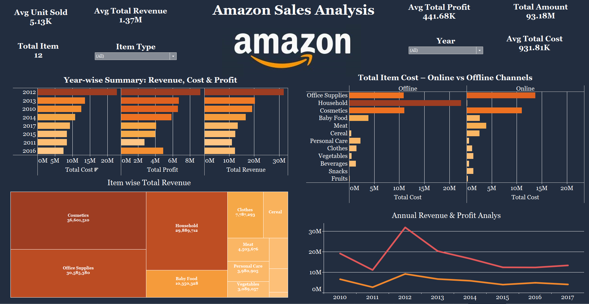
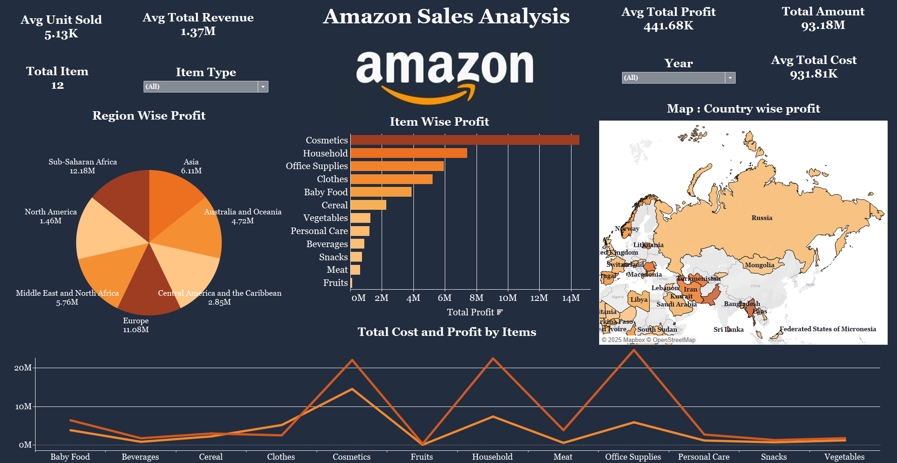
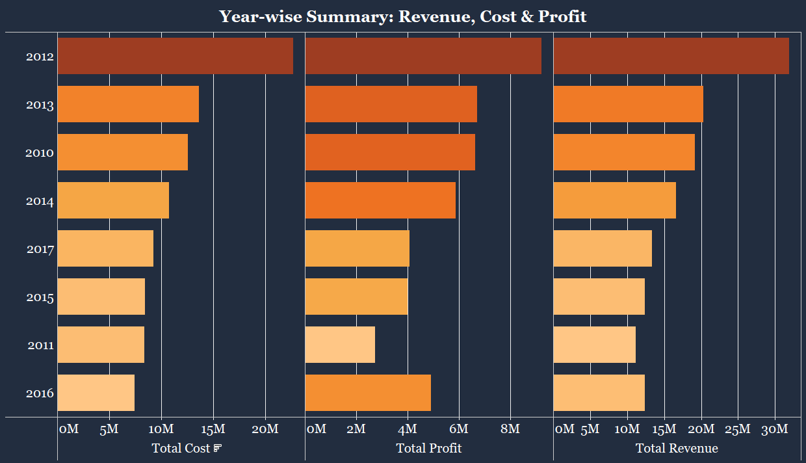

# Amazon Sales Dashboard — Tableau Project

This is a professional Tableau dashboard created to analyze Amazon sales data. It includes high-level KPIs, category breakdowns, trends, and actionable insights for business analysis.

---

## Project Highlights
- **KPIs Tracked:** Total Amount, Items, Cost
- **Year-wise Summary:** Revenue, Cost, Profit
- **Total Item Cost:** Online vs Offline
- **Profit Distribution:** Country-wise using map
- **Clean and Interactive Design**

---

## Folder Structure

| File | Description |
|------|-------------|
|  | Main Tableau dashboard screenshot |
|  | Tableau dashboard screenshot 2 |
|  | Bar chart showing yearly summary |
| !(Amazon_Sales_data.csv) | Cleaned dataset used in Tableau |
|  | Amazon logo used in the dashboard |
| `README.md` | This documentation file |

---

## Tools Used
- **Tableau Public** – for data visualization
- **Microsoft Excel** – for data cleaning and preprocessing

---

## Dataset Details

**File:** `dataset/amazon_data.xlsx`  
**Columns Include:**
- Order Date
- Total Revenue
- Total Cost
- Sales Channel
- Total Profit
- Item Type
- Region  
- Country

---

## About Me

Made by **Kesar Bareliwala**  
🔗 [LinkedIn Profile](https://www.linkedin.com/in/kesar-bareliwala-467b472a8)

---
